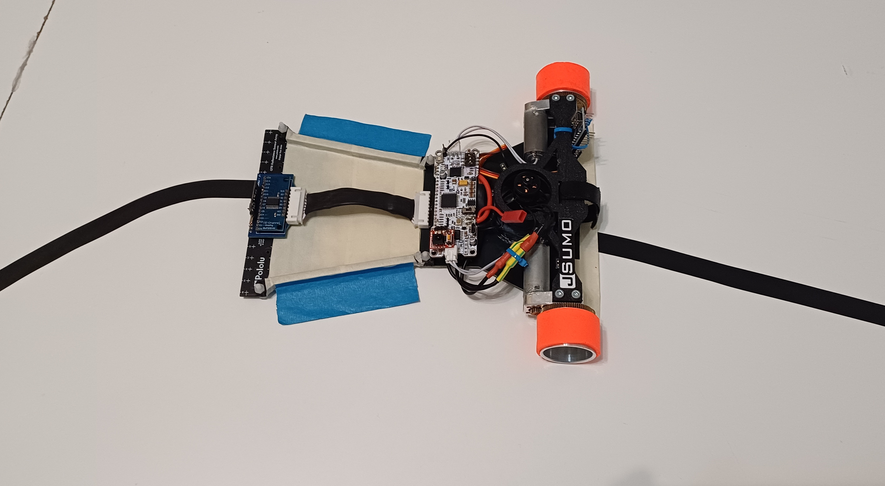

# RoboChallenge 2024 - Line Follower Classic, Turbo, and Enhanced Categories

✨ This year’s RoboChallenge 2024 was an unforgettable experience, filled with adrenaline, innovation, and intense competition! Representing the **JSumo team**, **JSUMO_LF** excelled in three categories, showcasing incredible adaptability and performance.

## Key Highlights
- **Line Follower Enhanced**: 6th out of 41 – my strongest finish yet!
- **Line Follower Turbo**: 20th out of 56 – pushing the limits with speed and precision!
- **Line Follower Classic (Kids)**: 12th out of 52 – a solid run for JSUMO_LF!

Big thanks to the incredible [@jsumocom](https://www.instagram.com/jsumocom/) team for their support.Excited to build on this experience for the future!

## Repository Contents
- 🤖 **Source Code**: Explore the well-documented codebase behind JSUMO_LF's 2024 performance.
- 📋 **Documentation**: Dive into additional details to understand the architecture and design choices.
- 📹 **Media**: See JSUMO_LF in action through photos and videos from RoboChallenge 2024, courtesy of [@andreip851](https://www.instagram.com/andreip851/).

## Components Used
- **Microcontroller**: JSumo XMotion
- **Motors**: Custom JSumo Motors
- **Wheels**: Custom JSumo Wheels
- **Sensors**:
  - Pololu QTR16A Sensor Array with Multiplexer Adapter
  - Pololu Distance Sensor
- **EDF**: QX-Motor 30mm for downforce
- **ESC**: BlHeli 30A
- **Power Supply**: 3S 450mAh Battery
- **Additional Module**: JSumo Start/Stop Module

## Future Upgrades
- Lightweight chassis for improved maneuverability
- Faster gear ratio for increased speed
- Switch from EDF to a Centrifugal Suction system for enhanced stability
- Custom sensor bar with multiplexer for optimized line detection

## 🚗🌟 **The robotics adventure continues! Looking forward to 2025’s competitions.**

## 📜 License
This project is licensed under the MIT License - see the [LICENSE](https://github.com/andreipopescufilimon/line-follower-2024/blob/main/LICENSE) file for details.